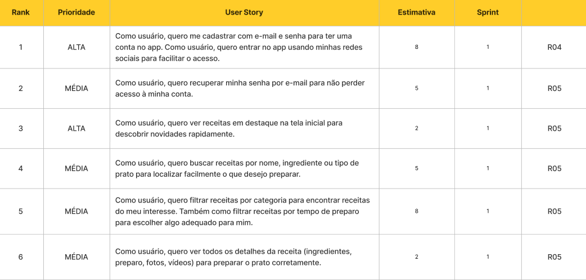
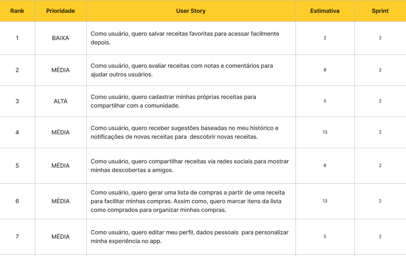
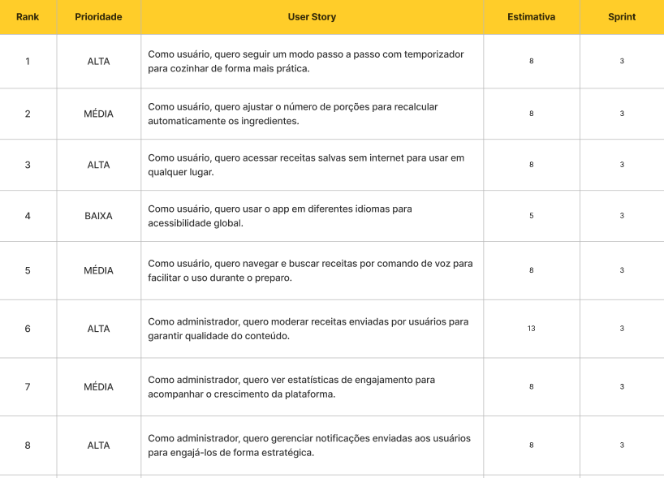

## Sprint 1

- Cadastro e login com e-mail/senha e redes sociais.
- Recuperação de senha por e-mail.
- Tela inicial com receitas em destaque.
- Busca de receitas por nome, ingrediente ou tipo de prato.
- Filtros por categoria, popularidade, tempo de preparo e dificuldade.
- Visualização completa da receita (ingredientes, preparo, fotos, vídeos).

---

## Sprint 2

- Favoritar receitas para acesso rápido.
- Avaliar receitas com notas e comentários.
- Cadastro de receitas pelos usuários (título, descrição, ingredientes, preparo, fotos e vídeos).
- Recomendações personalizadas com base no histórico.
- Notificações push sobre novas receitas e sugestões.
- Compartilhamento de receitas em redes sociais.
- Geração de lista de compras a partir de receitas.
- Marcar itens da lista de compras como adquiridos.
- Gerenciar perfil do usuário (dados pessoais, idioma, privacidade).

---

## Sprint 3

- Modo de preparo interativo passo a passo com temporizadores.
- Ajuste automático de porções (recalcular ingredientes).
- Acesso offline a receitas salvas.
- Suporte multilíngue para acessibilidade global.
- Busca e navegação por comandos de voz.
- Painel administrativo para moderação de receitas.
- Painel administrativo para estatísticas de engajamento.
- Painel administrativo para gerenciamento de notificações.
